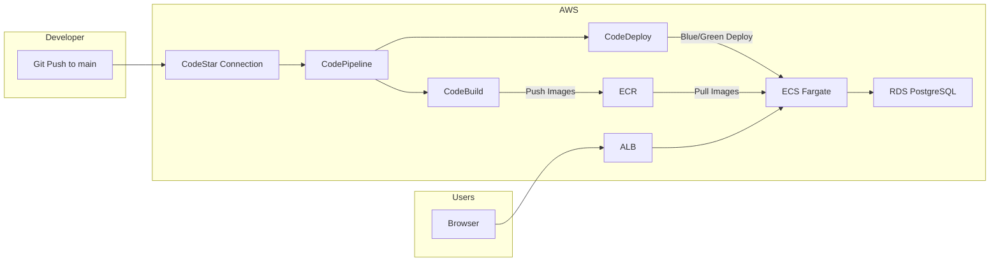
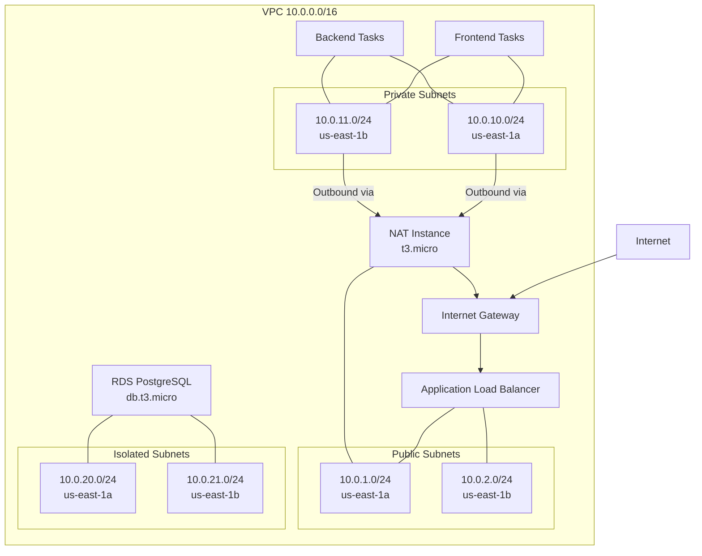
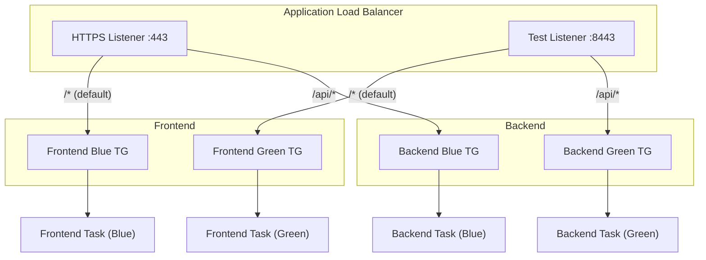
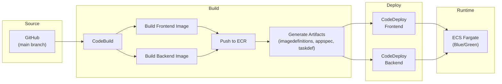

# Architecture

This document describes the OpsBoard infrastructure architecture, including network design, CI/CD pipeline flow, and component interactions.

---

## 1. High-Level Architecture



**Flow:**
1. A developer pushes code to the `main` branch on GitHub.
2. The CodeStar connection detects the change and triggers CodePipeline.
3. CodePipeline starts a CodeBuild project that builds Docker images for frontend and backend.
4. Built images are pushed to Amazon ECR.
5. CodeDeploy performs a blue/green deployment, launching new ECS tasks with the updated images.
6. The ALB shifts traffic from the blue target group to the green target group.
7. Users access the application through the ALB over HTTPS.

---

## 2. VPC Network Architecture



### Subnet Tiers

| Tier | CIDR Blocks | Purpose | Internet Access |
|------|-------------|---------|----------------|
| **Public** | 10.0.1.0/24, 10.0.2.0/24 | ALB, NAT Instance | Direct (IGW) |
| **Private** | 10.0.10.0/24, 10.0.11.0/24 | ECS Fargate Tasks | Outbound only (via NAT) |
| **Isolated** | 10.0.20.0/24, 10.0.21.0/24 | RDS PostgreSQL | None (local routes only) |

### Why 3 Tiers?

- **Public subnets** host only the ALB and NAT instance. No application code runs here.
- **Private subnets** host ECS tasks. They can reach the internet (for ECR image pulls, external APIs) via the NAT instance, but are not directly addressable from the internet.
- **Isolated subnets** host the database. They have no route to the internet at all, preventing any outbound data exfiltration from the database layer.

### NAT Instance vs. NAT Gateway

A NAT Gateway costs ~$32/month (fixed) plus data processing charges. A t3.micro EC2 instance configured as a NAT costs $0 during the AWS free tier period and ~$7.50/month afterward. For a development/portfolio project with low traffic, the NAT instance provides the same functionality at a fraction of the cost.

### S3 Gateway Endpoint

An S3 VPC endpoint is attached to the public and private route tables. This means ECR image layer pulls (stored in S3) and CodePipeline artifact access bypass the NAT instance entirely, reducing both latency and data transfer costs.

---

## 3. ALB Routing and Blue/Green Deployment



### Path-Based Routing

| Path Pattern | Target |
|-------------|--------|
| `/api/*` | Backend service (Flask) |
| `/*` (default) | Frontend service (Nginx + React) |

### Blue/Green Deployment Process

1. **Before deployment:** All production traffic flows to the blue target groups.
2. **Deployment starts:** CodeDeploy registers new ECS tasks in the green target groups.
3. **Test phase:** The test listener (port 8443) routes to green, allowing automated or manual validation.
4. **Cutover:** The HTTPS listener switches from blue to green target groups.
5. **Cleanup:** Original blue tasks are drained and stopped after a configurable wait period.
6. **Rollback:** If health checks fail during the deployment, CodeDeploy automatically rolls back by switching the listener back to blue.

Each service (frontend and backend) is deployed independently, each with its own blue and green target group pair.

---

## 4. CI/CD Pipeline Flow



### Pipeline Stages

**Stage 1 -- Source**
- CodePipeline detects changes via the AWS CodeStar GitHub connection.
- Source artifacts (full repository) are stored in an S3 bucket.

**Stage 2 -- Build**
- CodeBuild pulls the source artifact and executes the buildspec.
- Builds two Docker images: `frontend` and `backend`.
- Pushes both images to their respective ECR repositories, tagged with the commit hash.
- Generates deployment artifacts: `appspec.yaml` and `taskdef.json` for each service with the updated image URI.

**Stage 3 -- Deploy**
- CodeDeploy picks up the artifacts and initiates a blue/green deployment.
- New ECS task definitions reference the newly pushed images.
- Deployment follows the blue/green process described above.

### Artifact Flow

```
CodeBuild Output:
  |-- imageDetail.json          # Image URI for CodeDeploy substitution
  |-- appspec-frontend.yaml     # ECS deployment instructions (frontend)
  |-- appspec-backend.yaml      # ECS deployment instructions (backend)
  |-- taskdef-frontend.json     # ECS task definition template (frontend)
  `-- taskdef-backend.json      # ECS task definition template (backend)
```

---

## 5. Component Summary

| Component | AWS Service | Purpose |
|-----------|------------|---------|
| VPC | Amazon VPC | Network isolation with 3 subnet tiers |
| NAT | EC2 t3.micro | Outbound internet for private subnets (cost-optimized) |
| Load Balancer | ALB | HTTPS termination, path-based routing, blue/green traffic shifting |
| Certificate | ACM | Free TLS certificate for the custom domain |
| DNS | Route 53 | Domain resolution (A record alias to ALB) |
| Container Registry | ECR | Private Docker image storage |
| Compute | ECS Fargate | Serverless container hosting (no EC2 management) |
| Database | RDS PostgreSQL | Managed relational database in isolated subnets |
| Secrets | SSM Parameter Store | Database credentials as SecureString parameters |
| Pipeline | CodePipeline | CI/CD orchestration |
| Build | CodeBuild | Docker image building and testing |
| Deployment | CodeDeploy | Blue/green ECS deployments with rollback |
| Security Groups | VPC Security Groups | Layer-4 traffic filtering between tiers |

### Why These Choices?

- **ECS Fargate over EKS:** Fargate eliminates cluster management overhead and costs less for small workloads. EKS has a $73/month control plane fee.
- **CodePipeline over GitHub Actions:** Tighter integration with CodeDeploy for blue/green ECS deployments. GitHub Actions would require custom deployment scripts.
- **NAT Instance over NAT Gateway:** ~$32/month savings. Acceptable trade-off for a non-high-availability workload.
- **SSM Parameter Store over Secrets Manager:** Free for standard parameters. Secrets Manager charges $0.40/secret/month.
- **ALB over NLB:** Path-based routing needed to serve frontend and backend from the same domain/port.
- **RDS over Aurora Serverless:** Predictable cost; db.t3.micro is free-tier eligible.
